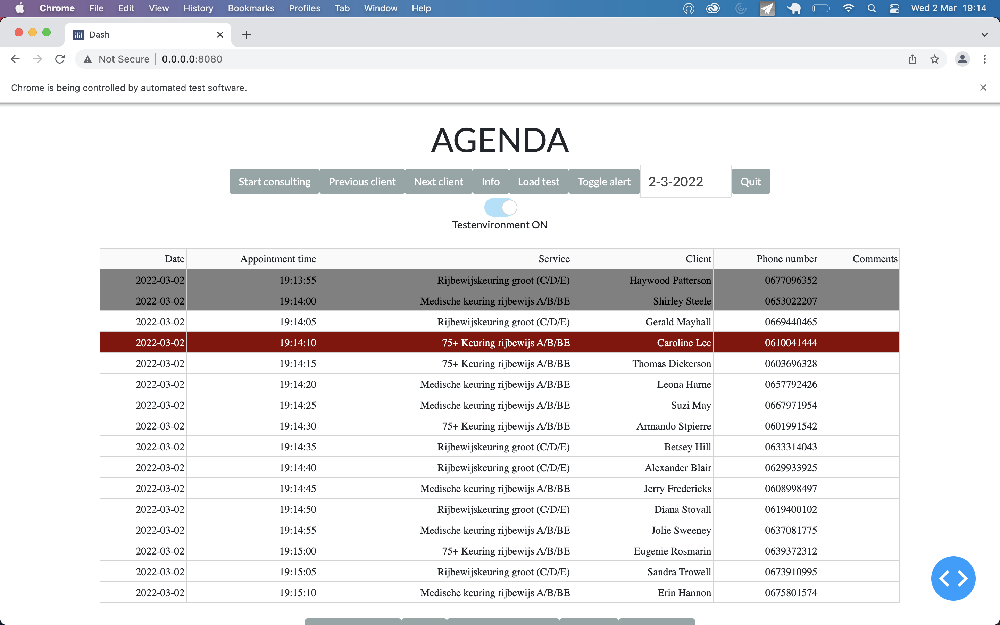
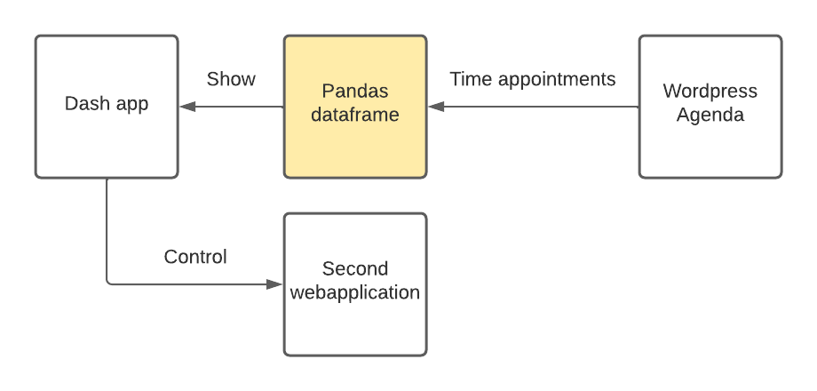

# RijbewijskeuringenHolland

## Screenshot

## Flowchart

## Run the program
1. Install python, git, necessary python modules and clone this repository. 
2. Run: python main.py.
3. Activate test environment by turning on the testenv switch.
4. Click on "load test" button.
